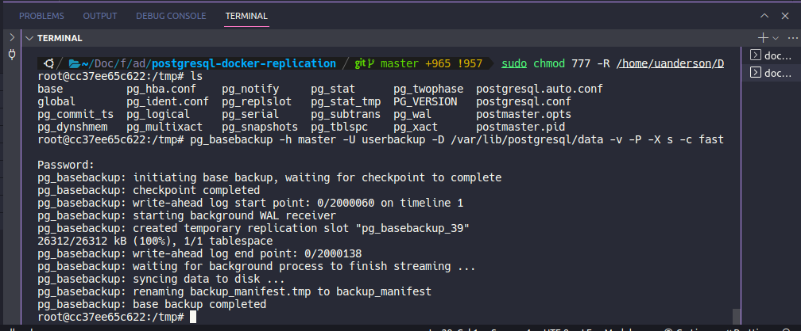
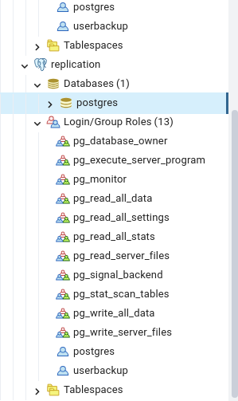
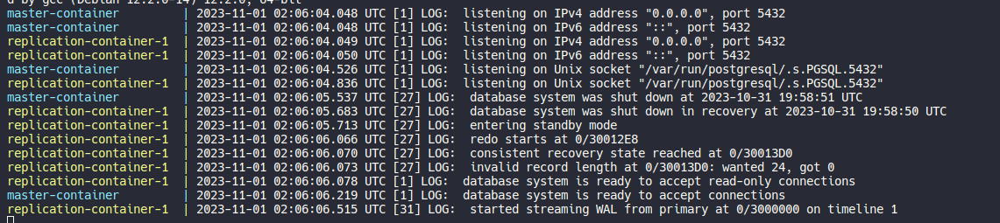
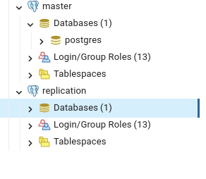
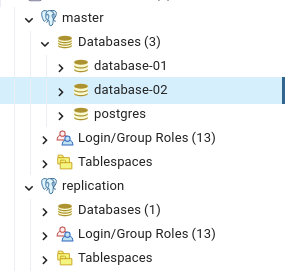
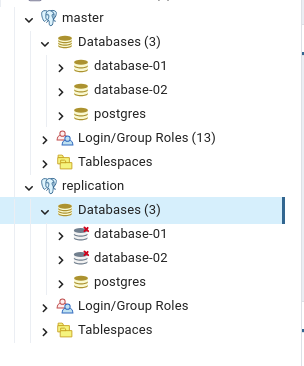
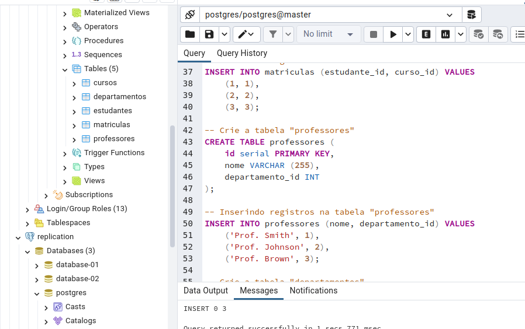
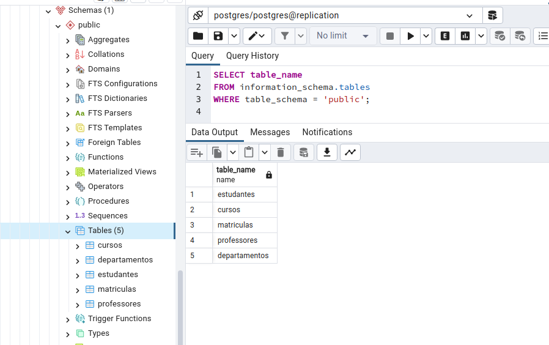

# ADMINISTRAÇÃO DE BANCO DE DADOS 

### PROFª SIMONE DUTRA MARTINS GUARDA

### UANDERSON FERREIRA DE OLIVEIRA

#### 2º Semestre de 2023


	 	 	 	
## REPLICAÇÃO DE BASE DE DADOS POSTGRESQL EM TEMPO REAL COM MULTIPLAS INTÂNCIAS
 
Palmas, Tocantins 2023


A replicação de base de dados PostgreSQL em tempo real com múltiplas instâncias é uma técnica avançada que permite manter cópias idênticas de um banco de dados PostgreSQL em diferentes servidores, garantindo alta disponibilidade, escalabilidade e recuperação de desastres. Essa abordagem é essencial para empresas que precisam garantir a disponibilidade contínua de seus sistemas e proteger seus dados contra falhas de hardware ou desastres.

Aqui está uma explicação detalhada de como funciona a replicação de banco de dados PostgreSQL em tempo real com múltiplas instâncias:

1. **Replicação Mestre-Escravo**:
   A base da replicação em PostgreSQL envolve uma configuração mestre-escravo. O servidor mestre é a fonte de dados primária, enquanto os servidores escravos mantêm cópias idênticas dos dados do mestre. O mestre é onde todas as operações de gravação (inserção, atualização, exclusão) ocorrem.

2. **Streaming Replication**:
   PostgreSQL oferece uma funcionalidade chamada "Streaming Replication", que permite que as alterações nos dados do mestre sejam transmitidas em tempo real para os servidores escravos. Isso é alcançado por meio do envio contínuo de registros de transações (WAL - Write-Ahead Logging) do mestre para os escravos.(https://www.postgresql.org/docs/current/wal-intro.html)

3. **Hot Standby**:
   Os servidores escravos configurados dessa maneira podem operar em modo de "Hot Standby". Isso significa que eles estão disponíveis para leitura e consulta, permitindo uma distribuição eficiente da carga de trabalho de leitura entre as instâncias escravas, enquanto o mestre lida com as gravações.

4. **Failover e Alta Disponibilidade**:
   Se o servidor mestre falhar, um dos servidores escravos pode ser promovido para se tornar o novo mestre. Isso garante alta disponibilidade e tolerância a falhas. A aplicação de um mecanismo de monitoramento e automação é crucial para automatizar o processo de failover e minimizar o tempo de inatividade.

5. **Recuperação de Desastres**:
   A replicação de banco de dados em tempo real também serve como uma medida eficaz de recuperação de desastres. Se ocorrer uma falha grave no data center ou no servidor mestre, você pode promover um escravo para mestre em um local de recuperação e minimizar a perda de dados.

6. **Multiplas Instâncias**:
   A replicação pode ser estendida para envolver várias instâncias escravas. Isso permite distribuir a carga de leitura de maneira mais eficiente e garantir que os aplicativos tenham acesso a dados atualizados sem sobrecarregar o servidor mestre.

7. **Latência Mínima**:
   Para alcançar a replicação em tempo real, é essencial manter a latência entre o mestre e os escravos o mais baixa possível. Isso pode ser alcançado usando uma rede de alta velocidade e hardware de qualidade.

8. **Segurança e Controle de Acesso**:
   A replicação deve ser configurada com medidas de segurança adequadas para garantir que apenas os servidores confiáveis possam se conectar ao mestre e que a transferência de dados seja criptografada para proteger a confidencialidade dos dados.
### FERRAMENTAS NECESSÁRIAS PARA EXECUTAR ESTE EXEMPLO

- Docker
- PgAdmin4 ou qualquer outra ferramenta de administração de banco de dados
- Acesso a internet

obs: todos os comandos apresentados estão sendo executados no SO Linux - Ubuntu 22.04.3 LTS  

### CONFIGURAÇÕES DO PRIMARY SERVER (MASTER)
Para este exemplo foi criado um diretorio de nome **'postgresql-docker-replication'** que contém:

- dois diretórios de nome master e replication. Além disso foi criado dois services/serviços no pgAdmin com os mesmo nome dos diretorio master e replication.

- e um arquivo de nome 'docker-compose.yml' com as seguintes configurações
```yml
version: '3.8' # Definindo a versão da especificação do Docker Compose utilizada.

services:
  master: # Definindo o serviço chamado "master".
    image: postgres:14    # Especificando a imagem Docker a ser usada, que é a imagem oficial do PostgreSQL versão 14.
    container_name: master-container     # Nomeando o contêiner como "master-container" para identificação.
    ports:
      - target: 5432  # Porta no contêiner (porta alvo).
        published: 5433 # Porta no host em que o contêiner será publicado.
        protocol: tcp # Protocolo de rede (TCP neste caso).
        mode: host  # Modo de publicação direta no host.
    environment:
      - POSTGRES_PASSWORD=123456
      - PGDATA=/var/lib/postgresql/data
          # Definindo variáveis de ambiente, como a senha do PostgreSQL e a localização dos dados.
    volumes:
      - ./master:/var/lib/postgresql/data # Mapeando um diretório local ("./master") para o diretório de dados do contêiner.
      - type: tmpfs
        target: /dev/shm
                # Configurando um volume baseado em tmpfs (RAM) no contêiner em /dev/shm
```

#### 1° CRIANDO UM USER PARA REALIZAR OPERAÇÕES DE BACKUP

Suba o/os containers docker configurado/os 
```
   docker-compose up
```
E acesse o pgAdmin4 informando o 
user default **postgres + POSTGRES_PASSWORD** configurada. 


Realizado o login com sucesso, crie um user de nome **'userbackup'** e acrecente as permissões de:
- login
- streaming replication and backups
- E defina uma senha para o mesmo

```sql
CREATE ROLE userbackup WITH
	LOGIN
	NOSUPERUSER
	NOCREATEDB
	NOCREATEROLE
	INHERIT
	REPLICATION
	CONNECTION LIMIT -1
	PASSWORD 'xxxxxx';
```

Para verificar os arquivos de configuração e necessário atribuir as permissões
necessárias:

- 755: permissão de leitura para todos, escrita somente para o dono, e
execução para todos ou 
- 777: permissão total, onde todos podem ler, escrever e executar.

#### 2° - APÓS CRIAR O USER DE BACKUP DEVEMOS CONFIGURAR O PG_HBA.CONF PARA DAR ACESSO AO MESMO:
    #TYPE   DATABASE        USER            ADDRESS                 METHOD
    host    replication     userbackup      0.0.0.0/0               scram-sha-256

#### 3° - CRIAR UM SLOT DE REPLICATION MASTER  (ARMAZENAMENTO DOS ARQUIVOS WAL)

    SELECT pg_create_physical_replication_slot('slot_replication_master');


Artigo recomendado para leitura: https://hevodata.com/learn/postgresql-replication-slots/

#### 4° - HABILITAR AS SEGUINTES CONFIGURAÇÕES NO POSTGRESQL.CONF PARA O PRIMARY SERVER (MASTER)
    #minimal, replica, or logical
    wal_level = logical	

    # (opcional) enable compression of full-page writes		
    wal_compression = on	

    #max number of walsender processes #(change requires restart)
    max_wal_senders = 10

    #max number of replication slots #(change requires restart)		
    max_replication_slots = 10 

### CONFIGURAÇÕES DO STANDBY SERVER (SLAVE/REPLICATION) PARA SE CONECTAR AO PRIMARY SERVER (MASTER)

    # connection string to sending server
    primary_conninfo = 'host=host port=port user=user password=password'	

    # ex: primary_conninfo = 'host=master port=5432 user=postgres password=123456'

    # replication slot on sending server (Informamos o slot criado anteriormente, basicamente indica para os slaves onde será armazenado os dados que devem ser replicados, ou seja permite que um servidor de replicação capture e mantenha registros de transações (WAL - Write-Ahead Logs) de um servidor mestre)

    primary_slot_name = 'slot_replication_master'

    # "off" disallows queries during recovery
    hot_standby = on		
        
    # send info from standby to prevent
    hot_standby_feedback = true		

Após realizar as configurações reinicializar os containers para validar as configurações feitas.

#### CRIANDO UMA INSTÂNCIA DE REPLICAÇÃO/SLAVE E CRIANDO UM BACKUP USANDO PGBASEBACKUP (FAZ O BACKUP DO CLUSTER INTEIRO)

Configure um novo database no arquivo docker-compose.yml com as mesmas configurações do master,
mas devemos mudar somente a porta 'published' e o 'PGDATA' para -> /tmp isso será feito
para subir um banco vazio num diretório temporário, pois não queremos as configurações que serão gerados, o que nós interessa é somente ter acesso ao database para pode rodar o comando abaixo que irá replicar todas as configurações do database master para o slave/replication.

```yml
  replication_1:
    image: postgres:14
    container_name: replication-container-1
    ports:
      - target: 5432
        published: 5434
        protocol: tcp
        mode: local
    environment:
      - POSTGRES_PASSWORD=123456
      - PGDATA=/var/lib/postgresql/data
    volumes:
      - ./replication:/var/lib/postgresql/data
      - type: tmpfs
        target: /dev/shm

```

Inicialize os container e acesse o bash do container de replicação através do comando:

```docker
     #Acesso ao bash
     docker exec -it replication-container-1 bash 

     #Acesse o diretório /tmp que contêm os arquivos do database
     cd /tmp

     #Execute o comando de backup
     pg_basebackup -h master -U userbackup -D /var/lib/postgresql/data -v -P -X s -c fast

```


    #pg_basebackup: Este é o comando em si, usado para iniciar o processo de backup base.

    #-h master: Isso especifica o host (ou endereço IP) do servidor PostgreSQL que você deseja fazer o backup. Nesse caso, o servidor é chamado "master". Você deve substituir "master" pelo nome ou endereço do servidor que deseja fazer o backup.

    #-U postgres: Isso especifica o nome de usuário que será usado para se autenticar no servidor PostgreSQL durante o processo de backup. Neste caso, o usuário é "postgres". Substitua-o pelo nome de usuário correto.

    #-D /var/lib/postgresql/data: Isso especifica o diretório de destino onde os dados de backup serão armazenados. Neste exemplo, o diretório é "/var/lib/postgresql/data". Certifique-se de que o usuário que executa o comando tenha permissões para escrever neste diretório.

    #-v: Isso ativa o modo "verbose", que fará com que o comando gere informações detalhadas sobre o progresso do backup.

    #-P: Isso faz com que o comando crie um arquivo de controle chamado "backup_label" no diretório de destino. Esse arquivo contém informações sobre o backup.

    #-X s: Isso define o método de transferência para sincronização (streaming). O PostgreSQL permite vários métodos de transferência, incluindo streaming, rsync, entre outros.

    #-c fast: Isso define a opção de compressão para "fast". O PostgreSQL oferece opções de compressão, como "fast" e "best", para comprimir os dados de backup. "fast" é uma opção de compressão mais rápida, enquanto "best" é uma opção mais lenta, mas mais eficiente em termos de espaço.

Depois que rodar o comando acima, pare os container e mude o PGDATA para o diretório
informado em **'-D /var/lib/postgresql/data'** para quando inicializar utilizar os dados
que estão neste diretorio.



#### DECLARAR UMA INSTÂNCIA DE REPLICAÇÃO 
E para informar ao postgresql que o database é uma instância de replicação, devemos criar o seguinte arquivo: **standby.signal** na raiz do projeto do database de replicação, somente isso já basta para que seja reconehcido.

Documentação oficial: https://www.postgresql.org/docs/current/hot-standby.html


Ao iniciar os databases no final dos logs deverá ver algo parecido com: **started streaming WAL from primary at 0/3000000 on timeline 1**


### SIMULAÇÃO DE REPLICAÇÃO DO SERVICE MASTER PARA REPLICATION/SLAVE


Criando dois databases na master e demonstrando a replicação, pode demorar alguns segundos ou minuntos devido a Latência Mínima que ocorre durante o processo.

 


Execute o comando sql no database postgres e verifique a replicação automática na instância de replicação;

```sql
-- Crie a tabela "estudantes"
CREATE TABLE estudantes (
    id serial PRIMARY KEY,
    nome VARCHAR (255),
    idade INT
);

-- Inserindo registros na tabela "estudantes"
INSERT INTO estudantes (nome, idade) VALUES
    ('Alice', 20),
    ('Bob', 22),
    ('Charlie', 21);

-- Crie a tabela "cursos"
CREATE TABLE cursos (
    id serial PRIMARY KEY,
    nome VARCHAR (255),
    departamento_id INT
);

-- Inserindo registros na tabela "cursos"
INSERT INTO cursos (nome, departamento_id) VALUES
    ('Matemática', 1),
    ('História', 2),
    ('Ciência da Computação', 3);

-- Crie a tabela "matriculas"
CREATE TABLE matriculas (
    id serial PRIMARY KEY,
    estudante_id INT,
    curso_id INT
);

-- Inserindo registros na tabela "matriculas"
INSERT INTO matriculas (estudante_id, curso_id) VALUES
    (1, 1),
    (2, 2),
    (3, 3);

-- Crie a tabela "professores"
CREATE TABLE professores (
    id serial PRIMARY KEY,
    nome VARCHAR (255),
    departamento_id INT
);

-- Inserindo registros na tabela "professores"
INSERT INTO professores (nome, departamento_id) VALUES
    ('Prof. Smith', 1),
    ('Prof. Johnson', 2),
    ('Prof. Brown', 3);

-- Crie a tabela "departamentos"
CREATE TABLE departamentos (
    id serial PRIMARY KEY,
    nome VARCHAR (255)
);

-- Inserindo registros na tabela "departamentos"
INSERT INTO departamentos (nome) VALUES
    ('Matemática'),
    ('História'),
    ('Ciência da Computação');

```




